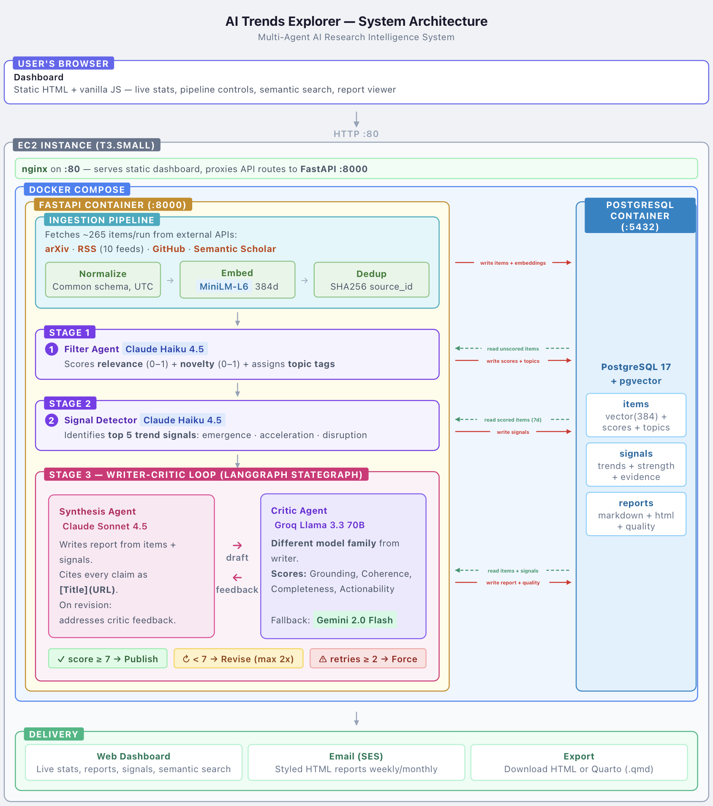

# AI Trends Explorer

A multi-agent system that automatically collects AI research papers, news, and signals from public sources, filters out noise, and produces actionable intelligence reports.

**Live demo:** [http://3.255.80.234](http://3.255.80.234)

**Course:** Prototyping Products with AI (PDAI) | ESADE Business School

**Team:** Leo Matthey, Pedro Resende, Ivan Salticov, Miguel Faria | MiBA Second Term, 2026

---

## The Problem

The AI landscape moves faster than any individual can track. Hundreds of papers hit arXiv weekly, companies ship new models overnight, and funding rounds reshape competitive dynamics before the news cycle catches up. Existing solutions – curated newsletters, analyst reports, RSS feeds – each fail in different ways: too narrow, too slow, too noisy, or too expensive.

We built a system that handles ingestion, filtering, and synthesis automatically, delivering quality-reviewed intelligence reports every week.

## What It Does

| Output | Schedule | Description |
|--------|----------|-------------|
| **Weekly Briefing** | Every Friday | Concise synthesis of the week's most important AI developments |
| **Monthly Deep Report** | 1st of each month | Comprehensive trend analysis with strategic signals |

Reports are viewable on the dashboard, exportable as styled HTML or Quarto documents, and delivered via email through Amazon SES.

---

## Architecture



---

## Multi-Agent Pipeline

The system uses three specialized agents orchestrated in a **writer-critic loop** via LangGraph:

| Agent | Model | Role |
|-------|-------|------|
| **Filter Agent** | Claude Haiku 4.5 | Scores each item for relevance (0-1) and novelty (0-1), assigns topic tags, discards noise |
| **Synthesis Agent** | Claude Sonnet 4.5 | Writes weekly briefings and monthly reports from scored items and detected signals |
| **Critic Agent** | Groq Llama 3.3 70B | Adversarial review on 4 dimensions: grounding, coherence, completeness, actionability |

The critic uses a **different model family** (Llama vs Claude) intentionally – same-model review tends to approve its own blind spots. Reports must score >= 7/10 across all dimensions or get revised with specific feedback. After 2 failed revisions, the report is force-published with a quality warning.

### Writer-Critic Loop (LangGraph StateGraph)

```
synthesize --> critique --> [decision]
                              |
                 +------------+------------+
                 |            |            |
            approved     retry < 2    retry >= 2
                 |            |            |
              publish      revise     force_publish
                 |            |            |
                END     synthesize        END
```

The loop is implemented as a formal LangGraph `StateGraph` with typed state, not ad-hoc retry logic. State carries items, signals, draft content, critic feedback, quality scores, and retry count through the graph.

---

## Data Sources

All free, public APIs – no paid subscriptions required:

| Source | Items/run | What it captures |
|--------|-----------|------------------|
| **arXiv** | ~45 papers | AI/ML papers from cs.AI, cs.LG, cs.CL |
| **RSS Feeds** | ~150 articles | TechCrunch, VentureBeat, MIT Tech Review, Google AI, OpenAI, Anthropic, Meta AI, HuggingFace, Crunchbase, SecurityWeek |
| **GitHub Trending** | ~30 repos | Trending AI repos (stars > 10, pushed in last 7 days) across 6 topics |
| **Semantic Scholar** | ~40 papers | Paper metadata and citations across 4 search queries |

Items are deduplicated on ingestion via deterministic source IDs (`{source}:{SHA256(key)[:16]}`). Every item is embedded at ingestion time using a local sentence-transformer model for semantic search.

---

## Semantic Search

Every item gets a 384-dimensional embedding (all-MiniLM-L6-v2, local CPU) stored in PostgreSQL via pgvector. This powers:

- **Dashboard search bar** – type a query, get the most semantically similar items ranked by cosine distance
- **Signal-item linking** – click a trend signal to see related items via embedding similarity or explicit evidence IDs

This is meaning-based, not keyword matching. A search for "computer vision" surfaces items about "image recognition architectures" even if those exact words don't appear.

---

## Tech Stack

| Component | Technology |
|-----------|-----------|
| Agent Framework | LangGraph + LangChain |
| Backend API | FastAPI (16 endpoints) |
| Database | PostgreSQL 17 + pgvector (Docker) |
| Embeddings | all-MiniLM-L6-v2 (local, CPU, 384 dimensions) |
| Scheduling | AWS Lambda + EventBridge (daily/weekly/monthly cron) |
| Email Delivery | Amazon SES |
| Observability | LangSmith |
| Dashboard | Static HTML + vanilla JS (glassmorphism dark theme) |
| Infrastructure | Terraform + EC2 + nginx |
| Package Manager | uv |

### LLM Cost Strategy (~$13-19/month)

| Role | Model | Monthly Cost | Why this model |
|------|-------|-------------|----------------|
| Filtering & signals | Claude Haiku 4.5 | ~$2-3 | Fast, cheap, great for classification |
| Report synthesis | Claude Sonnet 4.5 | ~$8-12 | Best quality-to-cost for long-form writing |
| Critic review | Groq Llama 3.3 70B | $0 (free) | Different model family for unbiased review |
| Critic fallback | Google Gemini 2.0 Flash | $0 (free) | Backup when Groq is rate-limited |
| Embeddings | all-MiniLM-L6-v2 | $0 (local) | No API cost, runs on CPU |

---

## Quick Start

### Prerequisites

- Python 3.12+
- [uv](https://docs.astral.sh/uv/) package manager
- [Docker](https://www.docker.com/) (OrbStack or Docker Desktop)
- API keys: [Anthropic](https://console.anthropic.com/) (required), [Groq](https://console.groq.com/) (required), [GitHub](https://github.com/settings/tokens) (optional), [Google AI](https://aistudio.google.com/apikey) (optional)

### Setup

```bash
# Clone the repo
git clone https://github.com/pedromgfcresende/PDAI-Project.git
cd PDAI-Project

# Install dependencies
uv sync

# Copy environment template and add your API keys
cp .env.example .env

# Start PostgreSQL
docker compose up -d

# Run the API server
uv run uvicorn agent_service.main:app --reload --port 8000

# Open the dashboard
open dashboard/index.html
```

### Run the Pipeline

```bash
# Ingest from all sources, score items, detect signals
curl -X POST http://localhost:8000/pipeline/daily

# Generate a weekly report (runs daily pipeline first)
curl -X POST http://localhost:8000/pipeline/weekly

# Generate a monthly report
curl -X POST http://localhost:8000/pipeline/monthly
```

Or use the dashboard buttons -- every pipeline step can be triggered from the UI.

---

## Project Structure

```
PDAI-Project/
|-- docker-compose.yml              # PostgreSQL (+ API in production profile)
|-- Dockerfile                      # Agent service container image
|-- init-db.sql                     # Database schema (3 tables, pgvector indexes)
|-- langgraph.json                  # LangGraph dev server config
|-- pyproject.toml                  # Dependencies (uv)
|-- uv.lock                        # Reproducible lock file
|-- .env.example                   # Environment variable template
|
|-- agent_service/                  # Python backend
|   |-- main.py                    # FastAPI app, 16 endpoints, pipeline orchestration
|   |-- config.py                  # Pydantic Settings (env vars, DB URL)
|   |-- models.py                  # Pydantic schemas (items, reports, signals, scores)
|   |-- db.py                      # PostgreSQL operations (pgvector search, CRUD)
|   |-- agents/
|   |   |-- pipeline.py            # LangGraph StateGraph (writer-critic loop)
|   |   |-- filter.py              # Relevance scoring (Claude Haiku 4.5)
|   |   |-- synthesizer.py         # Report generation (Claude Sonnet 4.5)
|   |   |-- critic.py              # Quality review (Groq Llama 3.3 / Gemini fallback)
|   |   +-- signals.py             # Trend signal detection (Claude Haiku 4.5)
|   |-- ingestion/
|   |   |-- arxiv_source.py        # arXiv API client
|   |   |-- semantic_scholar.py    # Semantic Scholar API client
|   |   |-- rss_news.py            # RSS feed parser (10 feeds)
|   |   |-- github_trending.py     # GitHub search API client
|   |   +-- normalize.py           # Normalization, dedup, embeddings
|   +-- prompts/                   # System prompts for each agent
|       |-- filter.txt             # Relevance/novelty scoring prompt
|       |-- weekly_synthesis.txt   # Weekly briefing prompt
|       |-- monthly_report.txt     # Monthly report prompt
|       +-- critic.txt             # Quality review prompt
|
|-- lambda-triggers/               # AWS Lambda functions (EventBridge cron)
|   |-- daily_ingest.py            # Daily 06:00 UTC: ingest + filter + signals
|   |-- weekly_report.py           # Friday 08:00 UTC: daily + weekly report + SES email
|   +-- monthly_report.py          # 1st of month 08:00 UTC: daily + monthly report + SES email
|
|-- infra/                         # Terraform deployment (EC2 + nginx)
|   |-- main.tf                    # EC2 instance, security group
|   |-- variables.tf               # Configurable parameters
|   |-- deploy.sh                  # Terraform wrapper script
|   +-- user-data.sh               # EC2 bootstrap (Docker, nginx, clone repo)
|
+-- dashboard/
    +-- index.html                 # Single-page dashboard (HTML + CSS + JS)
```

---

## API Reference

| Method | Endpoint | Description |
|--------|----------|-------------|
| GET | `/health` | System health check with item/report/signal counts |
| POST | `/ingest/{source}` | Ingest from one source: `arxiv`, `semantic_scholar`, `rss`, `github` |
| POST | `/ingest` | Ingest from all 4 sources |
| POST | `/filter?limit=N` | Score N unscored items with Filter Agent (Haiku) |
| POST | `/signals/detect?days=N` | Detect trend signals from last N days of scored items |
| GET | `/signals` | List all active trend signals |
| GET | `/signals/{id}/items?mode=evidence` | Get items related to a signal (`evidence` or `semantic` mode) |
| GET | `/items/search?q=query` | Semantic search across all items (pgvector cosine similarity) |
| POST | `/reports/generate?report_type=weekly` | Generate a report via the writer-critic pipeline |
| GET | `/reports?report_type=weekly&limit=10` | List recent reports |
| GET | `/reports/{id}/download` | Download report as self-contained styled HTML |
| GET | `/reports/{id}/qmd` | Export report as Quarto document |
| POST | `/pipeline/daily` | Full daily pipeline: ingest all + filter + detect signals |
| POST | `/pipeline/weekly` | Daily pipeline + generate weekly report |
| POST | `/pipeline/monthly` | Daily pipeline + generate monthly report |

---

## Deployment

The production instance runs on a single AWS EC2 `t3.small` (~$17/month) with Docker Compose, nginx, and three Lambda functions for scheduling.

```
Internet --> nginx (:80)
                |-- /               --> dashboard/index.html (static)
                |-- /health         --> FastAPI (:8000)
                |-- /ingest         --> FastAPI (:8000)
                |-- /filter         --> FastAPI (:8000)
                |-- /signals        --> FastAPI (:8000)
                |-- /reports        --> FastAPI (:8000)
                |-- /items          --> FastAPI (:8000)
                +-- /pipeline       --> FastAPI (:8000)
```

| Lambda | Schedule | Action |
|--------|----------|--------|
| `daily_ingest.py` | Every day 06:00 UTC | Ingest + filter + detect signals |
| `weekly_report.py` | Every Friday 08:00 UTC | Full weekly pipeline + email via SES |
| `monthly_report.py` | 1st of month 08:00 UTC | Full monthly pipeline + email via SES |

See [`infra/README.md`](infra/README.md) and [`infra/DEPLOYMENT.md`](infra/DEPLOYMENT.md) for Terraform setup instructions.

---

## Database Schema

Three tables in PostgreSQL with pgvector:

- **`items`** – All ingested content with embeddings (`vector(384)`), relevance/novelty scores, topic tags, and raw metadata (JSONB). Deduplicated on `source_id` (unique constraint).
- **`reports`** – Generated reports with markdown source, rendered HTML, quality scores, critic feedback (JSONB), revision count, and referenced item IDs.
- **`signals`** – Detected trend patterns with signal type (emergence/acceleration/disruption), strength score, evidence item IDs, and active/inactive flag.

Schema defined in [`init-db.sql`](init-db.sql).
